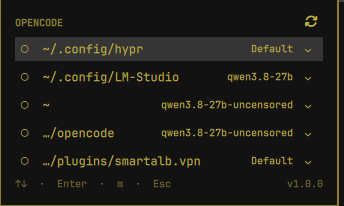
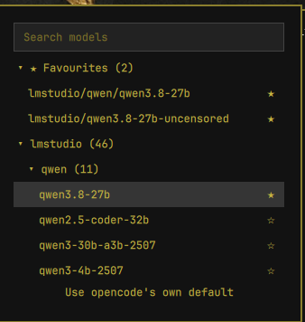

# opencode Launcher

An Omarchy bar widget that opens [opencode](https://opencode.ai) in a
project directory, with the model chosen before opencode starts.

The model travels as a command-line flag: opencode is started as
`opencode -m provider/model`. **Your `~/.config/opencode/opencode.json` is
never written to.** That is the whole point of this widget -- picking a
model changes nothing on disk except this plugin's own state, so opencode's
own configuration stays exactly as you left it, and running another opencode
session at the same time is never a race over a shared file.

## Screenshots




## Install

```
omarchy plugin add https://github.com/SmartALB/omarchy-opencode-launcher.git --enable
```

The directory is named after the plugin id from the manifest, not after the
repository: it lands in `~/.config/omarchy/plugins/smartalb.opencode/`.

Leaving off `--enable` installs the plugin disabled, so the code can be read
first. Enable it afterwards with:

```
omarchy plugin enable smartalb.opencode
```

Either way, restart the shell once so the QML is picked up:

```
omarchy-restart-shell
```

## Removal

```
omarchy plugin remove smartalb.opencode
```

That takes the plugin directory and its entry in `shell.json`. The
remembered model for each project and the cached model list are **not**
part of the plugin directory and survive both a removal and a later
reinstall -- a fresh install of the same plugin id picks up exactly what was
remembered before.

To clear them on purpose:

```
rm -rf "${XDG_STATE_HOME:-$HOME/.local/state}/omarchy/smartalb-opencode/"
rm -rf "${XDG_CACHE_HOME:-$HOME/.cache}/omarchy/smartalb.opencode/"
```

The first line forgets every project's chosen model; the second discards the
cached model list, which is rebuilt from opencode's own output the next time
the panel needs it.

## Requirements

- `omarchy-shell` -- this is a bar widget for it -- and `qt6-declarative`,
  which provides the QML runtime the panel is written against. Omarchy
  already brings both; they are named here so a stripped-down system knows
  what is missing.
- `opencode` itself, reachable on `PATH` (or via `OPENCODE_BIN`).
- `jq` -- every script that produces or reads JSON uses it.
- The launch chain, all of it part of Omarchy: `omarchy-launch-or-focus`
  (focuses an already-open window for a project instead of starting a
  second one), `xdg-terminal-exec` (opens your configured terminal) and
  `uwsm-app` (starts it in its own session, so it survives the panel
  closing). Without them a click reports the failure and starts nothing.
- `sqlite3`, optional. Without it, the "recent projects" list is simply
  empty; pinned projects, the model picker and launching all keep working.
  `sqlite3` is only needed to read opencode's own session database for
  recent-project discovery.

## Settings

| Key | Default | What it does |
|---|---|---|
| `barLabel` | `Icon` | What sits next to the bar icon. The model belongs to the project row, not to a single pill, so this only controls whether the number of currently open opencode windows is shown alongside the icon. |
| `recentCount` | `5` | How many directories from past opencode sessions are listed below the pinned projects. `0` turns the recent list off. |
| `catalogRefreshHours` | `24` | Hours before the cached model list is fetched from opencode again. The refresh button in the panel does this on demand regardless of age. |
| `confirmNewWindow` | `false` | Whether opening a project that is already running asks for confirmation before starting a second window. Off is the fast path the bar exists for. |

## Files

- `~/.config/omarchy/opencode-launcher.json` -- your pinned projects. You
  write this one yourself; see the example below.
  `~/.config/omarchy/opencode-projects.json` is read as a fallback if the
  first file does not exist, for anyone who set up pinned projects under
  the older name.
- `${XDG_STATE_HOME:-~/.local/state}/omarchy/smartalb-opencode/` -- the
  plugin's own state: the model remembered per project, and the models you
  starred in the picker.
- `${XDG_CACHE_HOME:-~/.cache}/omarchy/smartalb.opencode/` -- the cached
  model list fetched from opencode.
- `~/.config/omarchy/shell.json` -- gets the widget's entry under
  `bar.layout`, added by `omarchy plugin enable` / `--enable` and removed
  again by `omarchy plugin remove`.

### Pinning projects

`~/.config/omarchy/opencode-launcher.json` holds one object with a
`projects` list. Each entry needs a `path`; `name` is optional and defaults
to the path shortened with `~`:

```json
{
  "projects": [
    { "name": "api", "path": "~/code/backend" },
    { "path": "/srv/work/api" }
  ]
}
```

`path` may start with `~`. If the shape is wrong -- `projects` not a list,
or an entry without a `path` -- the panel says so instead of quietly
showing an empty list.

The file is optional: without it the panel shows only the projects opencode
was recently used in.

## How it works

Each project row remembers the model chosen for it the last time it was
started. Pressing the row starts opencode as `opencode -m provider/model`
in that project's directory -- the model is a flag on the process, nothing
is written into opencode's own configuration.

### The project row

Each project is a single line: a running marker (`●` running, `○`
not) followed by the project's name if the config gives one, or its path
otherwise. A path is shortened to its last three segments with a `…/`
prefix (`~/git/dotfiles` stays as-is; something deeper is cut down to,
say, `…/e2e/tests/fixtures`), and elided further from the left if the
row is still too narrow for it. The full absolute path always sits in a
tooltip on hover. The running marker lives outside the text that gets
shortened, so it can never be the part that disappears.

The plugin derives a stable app-id from the project directory and hands
the launch to Omarchy's own `omarchy-launch-or-focus`, which focuses an
existing window carrying that app-id instead of starting a second one.
`Shift+Enter` bypasses that and always starts a new window; with
`confirmNewWindow` on, that has to be confirmed once before it opens.

### Keys and clicks

The panel's footer line shows only the four most-used keys (`↑↓ · Enter ·
m · Esc`); the rest of this table -- `Shift+Enter`, `r`, and everything in
the model picker -- is not on the footer, only here.

| Key or click | What it does |
|---|---|
| `Up` / `Down` | Move the selection through the project list |
| `Enter`, left-click | Open the selected project, or focus its window if it is already open |
| `Shift+Enter` | Always open a *second* window, even if one is running |
| `m`, right-click, or the `⌄` chip | Open the model picker for that project |
| `r`, middle-click on the bar icon, or the `⟳` button | Reload the project list and the model list |
| `Esc` | Close the model picker, or the panel if no picker is open |

### The model picker

Models are grouped by provider, each group collapsed behind a header
line showing the provider's name and how many models it has, e.g.
`opencode (64)`. Opening the picker expands the group holding the
project's current model, if any, with the cursor on that model; everything
else starts collapsed.

Inside a provider that has enough structure to make it worthwhile, a
third level splits the group further into sub-groups: for a three-segment
id such as `lmstudio/google/gemma-3-12b` the sub-group is the middle
segment (`google`); for a two-segment id such as `opencode/gpt-5-codex`
it is the model name up to its first hyphen (`gpt`). A provider only gets
split when that produces at least two sub-groups with at least two
members each -- otherwise it stays a flat list. A would-be sub-group with
just one member is not given its own header; that model is listed flat,
after the real sub-groups.

Row text is shortened to whatever the headers above it haven't already
said: under `lmstudio › google` a row just reads `gemma-3-12b`; a model
that is the only one of its kind keeps its provider (`liquid/lfm-x`),
since no header named it; a flat, unsplit provider strips only its own
name. Typing anything drops all of this -- search flattens every level
into one list and matches against each model's full id, even though the
grouped view would have shown it shortened.

Starred models get a `★ Favourites (n)` group of their own at the very
top, shown only once at least one model is starred, and always expanded
when the picker opens. It is a shortcut, not a move: a starred model
still appears in its own provider group as well, and provider counts
don't change because of it. Rows inside Favourites show the full model
id, since "Favourites" doesn't say which provider they belong to.

| Key or click | What it does |
|---|---|
| type anything | Filter the list, flattening every group |
| `Up` / `Down` | Move the selection |
| `Enter`, click a row | Use that model for this project, or expand/collapse a header |
| `Enter` with no matches | Use exactly what you typed as the model id |
| `*`, or click the star | Star or unstar the selected model |
| the bottom row | Forget this project's model and let opencode use its own default |
| `Esc` | Close the picker without changing anything |

## Tests

```
./test/run.sh
```

Runs the full suite across the four scripts and the panel and prints its
own pass/fail tally at the end. Run against a sandboxed `PATH`, state
directory and cache directory -- no test touches the real configuration or
a real opencode installation.

```
./test/mutation.sh
```

**Run this one from a copy of the plugin directory, not from an installed,
enabled plugin.** It rewrites files under `bin/`, the `.qml` files and
`test/run.sh` in place and restores each one immediately afterwards --
and Omarchy's plugin registry watches the plugin directory with
`inotifywait` and reloads the shell on every change. Run in place, that is
dozens of live bar reloads, several of them running deliberately weakened
code. Copy the directory somewhere outside `~/.config/omarchy/plugins/`
first (`cp -a`) and run it there.

Each probe removes a single safeguard from the code and records what
happened, with the name of the failing test and its assertion message --
not merely that something failed. Most probes are expected to turn at
least one test red; that is the proof a test really checks the property it
claims. A few are expected to stay *green* on purpose, because they remove
only one of two independent layers and the remaining layer carries alone;
those declare their expectation themselves and verify it their own way
rather than by running the suite. The runner prints how many probes ran,
how many met each expectation, and how many proved nothing, and exits
non-zero if any probe missed its expectation.

A green suite proves nothing on its own. This project's own history counts
a whole series of tests that passed while proving nothing about the
behaviour they were meant to guard; the probes exist to catch that
mechanically instead of by review.

## License

MIT -- see [LICENSE](LICENSE).
